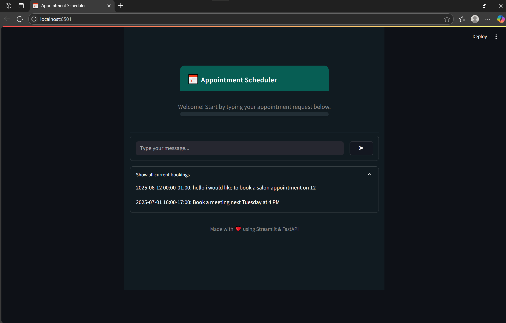
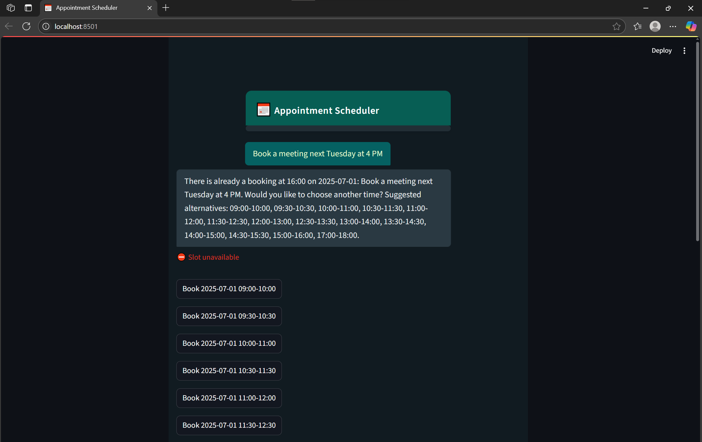

# Appointment Scheduler

<p align="center">
  
  
</p>

A conversational AI agent for scheduling appointments via a WhatsApp-like chat interface. Built with FastAPI, LangGraph, and Streamlit. Calendar data is stored in a JSON file for easy extensibility.

---

## ✨ Features
- **Chat-based appointment scheduling** with natural language
- **WhatsApp-inspired UI** (dark/light theme)
- **Conflict detection** and alternative slot suggestions
- **JSON-based calendar backend** (Google Calendar ready)
- **Modular, extensible architecture**
- **View all current bookings**

## 🛠️ Tech Stack
- [FastAPI](https://fastapi.tiangolo.com/) (backend API)
- [Streamlit](https://streamlit.io/) (frontend UI)
- [LangGraph](https://github.com/langchain-ai/langgraph) (agent logic)
- [python-dateutil](https://dateutil.readthedocs.io/en/stable/) (NLP time parsing)
- [pydantic](https://docs.pydantic.dev/) (data validation)

## 🚀 Getting Started

### 1. Clone the repository
```bash
git clone <your-repo-url>
cd calendr
```

### 2. Install dependencies
```bash
pip install -r requirements.txt
```

### 3. Run the backend (FastAPI)
```bash
uvicorn backend.main:app --reload
```

### 4. Run the frontend (Streamlit)
```bash
streamlit run frontend/app.py
```

---

## 💬 Usage
- Type your appointment request in natural language (e.g., "Book a meeting next Tuesday at 4 PM").
- The agent will detect intent, extract time, check for conflicts, and book or suggest alternatives.
- View all current bookings in the expandable section.

---

## 🌐 Deployment
- Deploy on [Streamlit Community Cloud](https://streamlit.io/cloud) or your preferred platform.
- **.gitignore** is set up to exclude secrets, venv, and local calendar data.
- For production, consider switching to a database or Google Calendar backend.

---

## 📁 Project Structure
```
calendr/
  backend/
    main.py
    agent.py
    calendar_service.py
    calendar.json
    models.py
  frontend/
    app.py
  assets/
    bk1.png
    bk3.png
  requirements.txt
  README.md
  .gitignore
```

---

## 🙏 Credits
- Made with ❤️ using FastAPI, Streamlit, and LangGraph.
- Inspired by WhatsApp UI.

---

## 📸 Screenshots
<p align="center">
  
  
</p> 